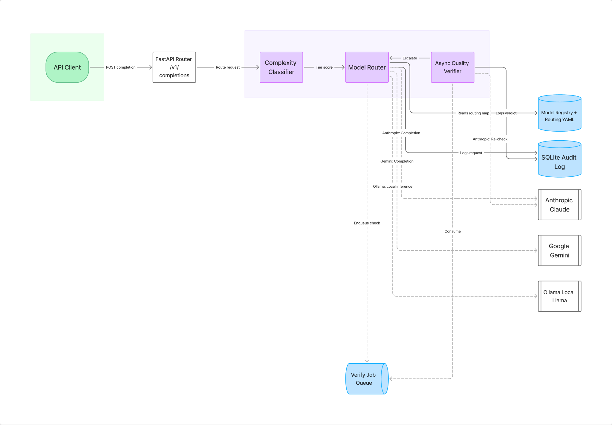

# LLM Cost AutoPilot

# Reduced LLM API costs by **36.7%** vs all GPT-4o

Demo aggregate (offline seed, `n=84`): saved **$0.1078**
(actual $0.1862 vs GPT-4o $0.2940). Recompute anytime:

```bash
PYTHONPATH=. python -m scripts.show_savings --demo
```

Dashboard hero (same metric): 

```bash
streamlit run dashboard/app.py --server.address=127.0.0.1 --server.port=8501
```

An intelligent routing layer in front of multiple LLM providers. It scores each
request's complexity, routes it to the cheapest model that can handle it well,
and asynchronously verifies that the routing decision was correct.



---

## Architecture (honest)

```
Client ──► FastAPI (api) ──► classifier → routing map → provider
                │                      │
                │              log_completion → data/requests.db
                │                      │
                └─ in-process asyncio verify (same process)
                         │
                         └─ feedback / failure JSONL → data/

         worker (separate container) ── watches data/ ──► retrain_from_feedback
```

**Verification queue:** `enqueue_verification` is an **in-memory asyncio**
queue inside the API process. It does **not** cross containers. The compose
`worker` shares the `./data` volume (SQLite + JSONL) and runs the classifier
retrain flywheel — it does not drain the API's asyncio queue.

**SQLite:** `data/requests.db` lives on the shared volume (gitignored).

**Auth:** Local/portfolio API is **unauthenticated**. Do not expose publicly
without real auth. No wildcard CORS with credentials.

---

## Quick start — Docker Compose (Phase 5.3)

```bash
# 1. Copy env template (no secrets in the image; fill keys as needed)
cp .env.example .env

# 2. Build + run API + worker (shared ./data volume for SQLite/JSONL)
docker compose up --build

# 3. Health + savings
curl -s http://127.0.0.1:8000/healthz
curl -s http://127.0.0.1:8000/v1/stats
```

Compose publishes the API on **127.0.0.1:8000** only. Containers run as
non-root, with `no-new-privileges`, and **without** `privileged: true`.
Set `ALLOW_ROUTING_CONFIG_WRITE=0` outside local demos (that flag is **not** auth).

| Service | Role |
|---|---|
| `api` | `uvicorn app.api.main:app` — completions + config endpoints; in-process verify |
| `worker` | `python -m app.worker.main` — data/ watch + optional retrain |

Validate the compose file (no daemon required for `config`):

```bash
docker compose config
```

Offline worker smoke (no Docker):

```bash
PYTHONPATH=. python -m scripts.smoke_worker
```

---

## Quick start — local venv

```bash
python3 -m venv .venv
source .venv/bin/activate
pip install -r requirements.txt
cp .env.example .env   # then add real keys if you want live providers

# Offline API smoke (TestClient + mocked provider)
PYTHONPATH=. python -m scripts.smoke_api

# Run API on localhost
PYTHONPATH=. uvicorn app.api.main:app --host 127.0.0.1 --port 8000
# Docs: http://127.0.0.1:8000/docs
```

---

## HTTP API

| Method | Path | Purpose |
|---|---|---|
| `POST` | `/v1/completions` | Router chooses the model; clients do not |
| `GET` | `/v1/models` | Registry models + costs (no secrets) |
| `GET` | `/v1/stats` | Cost savings aggregates (no raw prompts) |
| `GET`/`PUT` | `/v1/routing-config` | Read/update tier→model map (`configs/routing_map.yaml`) |

```bash
curl -s http://127.0.0.1:8000/v1/completions \
  -H 'Content-Type: application/json' \
  -d '{"prompt":"Convert March 3, 2026 to YYYY-MM-DD."}'

curl -s http://127.0.0.1:8000/v1/models
curl -s http://127.0.0.1:8000/v1/stats
curl -s http://127.0.0.1:8000/v1/routing-config
```

---

## Cost dashboard

```bash
PYTHONPATH=. python -m scripts.smoke_metrics
PYTHONPATH=. python -m scripts.show_savings --demo
streamlit run dashboard/app.py --server.address=127.0.0.1 --server.port=8501
```

If `data/requests.db` is empty, use **Load demo data** in the sidebar.
Charts are aggregates only (no raw prompts).

---

## Project layout

| Path | Purpose |
|---|---|
| `app/api/` | FastAPI completions + config endpoints |
| `app/worker/` | Compose background worker (data/ watch + retrain) |
| `app/providers/` | Unified `send_request` + model registry |
| `app/classifier/` | Features + complexity model + feedback flywheel |
| `app/quality/` | Thresholds, in-process verify queue, escalation |
| `app/audit/` | SQLite request audit trail |
| `app/metrics/` | Savings aggregates (`cost_reduction_pct`) |
| `configs/` | YAML: tiers, routing map, thresholds, escalation |
| `Dockerfile` / `docker-compose.yml` | API + worker + shared `data/` volume |
| `.env.example` | Env template — copy to `.env` (gitignored) |

See [`AGENTS.md`](./AGENTS.md) for the full 6-phase build plan and current status.

---

## Notes

- **Python:** 3.11+ (Docker image uses 3.11-slim). Local `.venv` may be newer.
- **Secret hygiene:** keys only in `.env` (gitignored). Rotate if exposed.
- **Providers are optional:** missing `ANTHROPIC_API_KEY` / `OPENAI_API_KEY` /
  `GEMINI_API_KEY` → that provider skips or returns HTTP 503 on live calls.
  Offline smokes never need keys.
